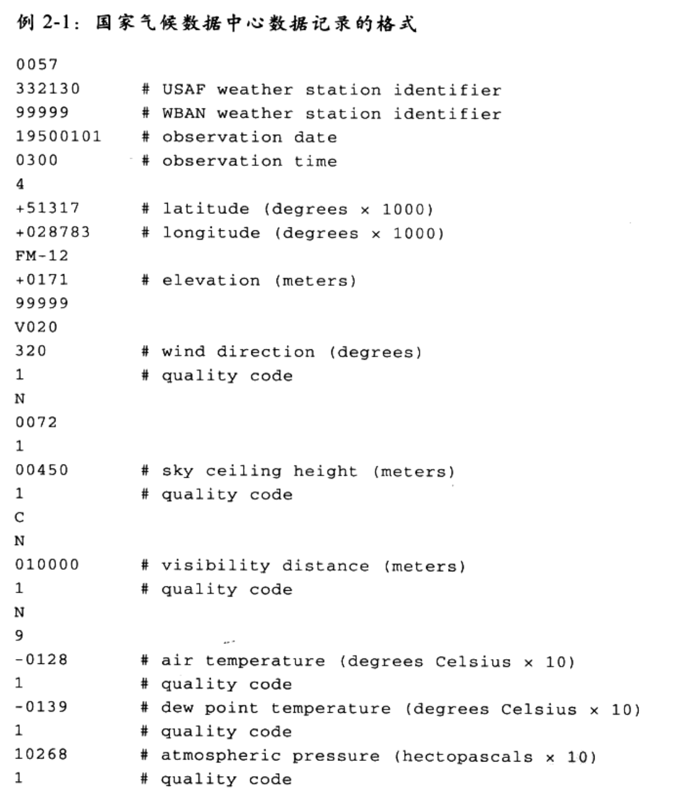
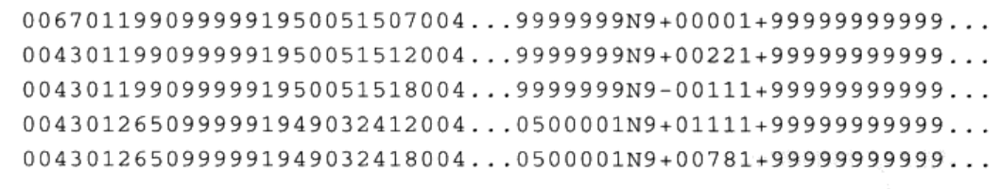
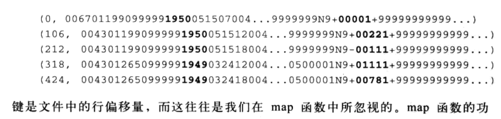
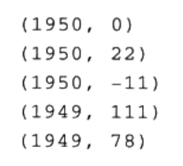
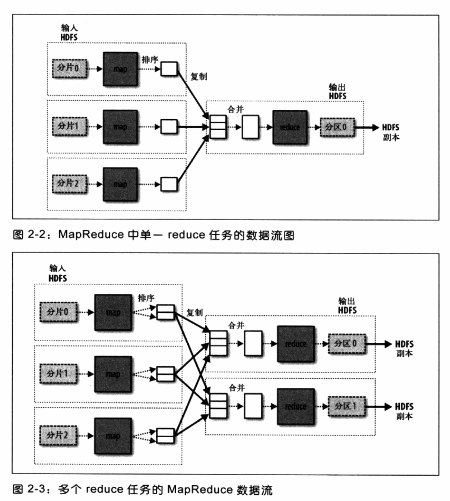
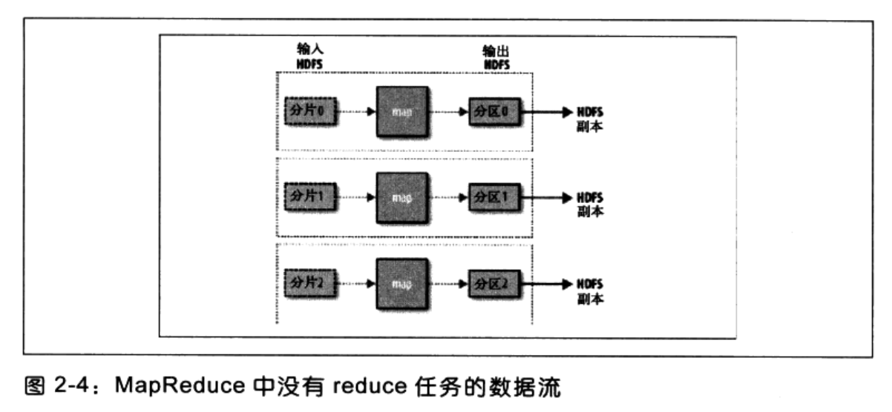

# Hadoop

- [Hadoop](#hadoop)
- [MapReduce](#mapreduce)
  - [数据的格式](#数据的格式)
  - [使用Hadoop进行数据分析](#使用hadoop进行数据分析)
    - [map和reduce](#map和reduce)
    - [Java MapReduce](#java-mapreduce)
  - [分布化](#分布化)
    - [数据流](#数据流)
    - [具体定义combiner](#具体定义combiner)
- [Hadoop分布式文件管理系统](#hadoop分布式文件管理系统)
  - [HDFS的概念](#hdfs的概念)
  - [Java接口](#java接口)
    - [从Hadoop URL中读取数据](#从hadoop-url中读取数据)
    - [使用FIleSystem API读取数据](#使用filesystem-api读取数据)
    - [写入数据](#写入数据)
    - [目录](#目录)
    - [查询文件系统](#查询文件系统)
  - [通过distcp进行并行复制](#通过distcp进行并行复制)
  - [Hadoop归档文件](#hadoop归档文件)

# MapReduce
## 数据的格式
每个数据都储存在一串数字的特定位置


## 使用Hadoop进行数据分析
### map和reduce

- map阶段
    > 数据准备阶段

    输入：一个很长的字符串（NCDC格式的数据）
    输出：处理之后的数据（提取、计算）
    e.g.
    输入：
    
    键值对：
    
    输出：
    
- reduce阶段
    > 数据处理阶段

    按照一定规律进行处理数据，并输出

### Java MapReduce
> 可以借鉴[CSDN](https://blog.csdn.net/qq_36419130/article/details/84348773)

map函数由Mapper接口实现，声明了`map()`方法
e.g. Mapper 接口
```java
import java.io.IOException;

import org.apache.hadoop.io.IntWritable;
import org.apache.hadoop.io.LongWritable;
import org.apache.hadoop.io.Text;
import org.apache.hadoop.mapred.MapReduceBase;
import org.apache.hadoop.mapred.Mapper;
import org.apache.hadoop.mapred.OutputCollector;
import org.apache.hadoop.mapred.Reporter;

public class MaxTemperatureMapper extends MapReduceBase implements Mapper<LongWritable, Text, Text, IntWritable> {

    private static final int MISSING = 9999;

    public void map(LongWriteable key, Text value, OutputCollector<Text, IntWritable> output, Reporter reporter) throws IOException {
        String line = value.toString();
        String year = line.substring(15, 19);
        int airTemperature;

        if(line.charAt(87) == '+') {
            airTemperature = Integer.parseInt(line.substring(88, 92));
        } else {
            airTemperature = Integer.parseInt(line.substring(87, 92));
        }

        String quality = line.substring(92, 93);
        if(airTemperature != MISSING && quality.matches("[01459]")) {
            output.collect(new Text(year), new IntWritable(airTemperature));
        }
    }
}

```

reduce函数在使用Reducer时被定义
```java
import java.io.IOException; import java.util.Iterator;
import org.apache.hadoop.io.IntWritable;
import org.apache.hadoop.io.Text;
import org.apache.hadoop.mapred.MapReduceBase; 
import org.apache.hadoop.mapred.OutputCollector;
import org.apache.hadoop.mapred.Reducer;
import org.apache.hadoop.mapred.Reporter;

public class MaxTemperatureReducer extends MapReduceBase implements Reducer<Text, IntWritable, Text, IntWritable> {
    public void reduce(Text key, Iterator<IntWritable> values, OutputCollector<Text, IntWritable> output, Reporter reporter) throws IOException {
        int maxValue = Integer.MIN_VALUE; 
        while (values.hasNext()) {
            maxValue = Math.max(maxValue, values.next().get()); 
        }
        output.collect(key, new IntWritable(maxValue)); 
    }
}
```

主程序
```java
import java.io.IOException;
import org.apache.hadoop.fs.Path;
import org.apache.hadoop.io.IntWritable;
import org.apache.hadoop.io.Text;
import org.apache.hadoop.mapred.FileInputFormat; 
import org.apache.hadoop.mapred.FileOutputFormat; 
import org.apache.hadoop.mapred.JobClient;
import org.apache.hadoop.mapred.JobConf;

public class MaxTemperature {
    // 输入指定的输入输出数据，
    // e.g. java MaxTemperature ./in ./out
    public static void main(String[] args) throws IOException { 
        if (args.length != 2) {
            // 报错信息
            System.err.println("Usage: MaxTemperature <input path> <output path>");
            System.exit(-1); 
        }
        JobConf conf = new JobConf(MaxTemperature.class);
        conf.setJobName("Max temperature");

        // 定义输入的路径
        FileInputFormat.addInputPath(conf, new Path(args[0]));

        // 定义输出的路径
        FileOutputFormat.setOutputPath(conf, new Path(args[1]));

        // 指定要使用的map和reduce类型
        conf.setMapperClass(MaxTemperatureMapper.class); 
        conf.setReducerClass(MaxTemperatureReducer.class);

        // 控制map和reduce的输出类型
        conf.setOutputKeyClass(Text.class); conf.setOutputValueClass(IntWritable.class);

        // 提交作业并等待完成
        JobClient.runJob(conf); 
    }
}
```

- 新的MapReduce API
    1. 新的API倾向于使用抽象类（利于扩展）
        > Mapper和Reducer是抽象类
    2. 新API在`org.apache.hadoop.mapreduce`包中，之前的API在`org.apache.hadoop.mapred`
    3. 新API广泛使用context object，并允许用户代码与M阿婆R额度册系统进行通讯。e.g. MapContext基本上充当着JobConf的OutputCollextor和Reporter的角色。
    4. 新API同时支持“推”，“拉”的迭代，新API允许把记录从map()方法拉出。
    5. 作业控制的执行由Job类来负责，而不是JobClient。

    新的API下重构代码
    ```java
    public class NewMaxTemperature { 
        static class NewMaxTemperatureMapper
        extends Mapper<LongWritable, Text, Text, IntWritable> {
            private static final int MISSING = 9999;
            public void map(LongWritable key, Text value, Context context) throws IOException, InterruptedException {
                String line = value.toString();
                String year = line.substring(15, 19);
                int airTemperature;
                if (line.charAt(87) == '+') { // parseInt doesn't like leading plus signs
                    airTemperature = Integer.parseInt(line.substring(88, 92)); 
                } else {
                    airTemperature = Integer.parseInt(line.substring(87, 92)); 
                }
                String quality = line.substring(92, 93);
                if (airTemperature != MISSING && quality.matches("[01459]")) {
                    context.write(new Text(year), new IntWritable(airTemperature)); 
                }
            } 
        }

        static class NewMaxTemperatureReducer
        extends Reducer<Text, IntWritable, Text, IntWritable> {
            public void reduce(Text key, Iterable<IntWritable> values, Context context) throws IOException, InterruptedException {
                int maxValue = Integer.MIN_VALUE; 
                for (IntWritable value : values) {
                    maxValue = Math.max(maxValue, value.get()); 
                }
                context.write(key, new IntWritable(maxValue)); 
            }
        }

        public static void main(String[] args) throws Exception { 
            if (args.length != 2) {
                System.err.println("Usage: NewMaxTemperature <input path> <output path>");
                System.exit(-1); 
            }
            Job job = new Job(); 
            job.setJarByClass(NewMaxTemperature.class);
            FileInputFormat.addInputPath(job, new Path(args[0])); 
            FileOutputFormat.setOutputPath(job, new Path(args[1]));
            job.setMapperClass(NewMaxTemperatureMapper.class); job.setReducerClass(NewMaxTemperatureReducer.class);
            job.setOutputKeyClass(Text.class); 
            job.setOutputValueClass(IntWritable.class);
            System.exit(job.waitForCompletion(true) ? 0 : 1);
        } 
    }
    ```

## 分布化
### 数据流


```
map1:
    (1950, 0)
    (1950, 10)
    (1950, 20)      Reduce:
map2:           -->     (1950, [0, 20, 10, 25, 15])
    (1950, 25)
    (1950, 15)

output:
    (1950, 25)
```

- combiner: 在每个map中计算出数据，之后再在reduce里计算
- 用combiner 减少map与reduce之间的数据传输量

### 具体定义combiner
使用combiner高效查找
```java
public class MaxTemperatureWithCombiner {
    public static void main(String[] args) throws IOException { 
        if (args.length != 2) {
            System.err.println("Usage: MaxTemperatureWithCombiner <input path> " + "<output path>");
            System.exit(-1); 
        }
        JobConf conf = new JobConf(MaxTemperatureWithCombiner.class);
        conf.setJobName("Max temperature");
        FileInputFormat.addInputPath(conf, new Path(args[0])); 
        FileOutputFormat.setOutputPath(conf, new Path(args[1]));
        conf.setMapperClass(MaxTemperatureMapper.class); 

        // 设置combiner类
        conf.setCombinerClass(MaxTemperatureReducer.class); 

        conf.setReducerClass(MaxTemperatureReducer.class);
        conf.setOutputKeyClass(Text.class); 
        conf.setOutputValueClass(IntWritable.class);
        JobClient.runJob(conf); 
    }
}
```

# Hadoop分布式文件管理系统
## HDFS的概念
- 块：代表一个磁盘能够读写的最小数据量；HDFS中默认为64MB【减少寻址开销】（小于一个块的内容不会独占一个）好处方便跨磁盘，利用抽象单元可以简化储存子系统fsck显示块的信息
- 名称节点与数据节点（名称节点管理者，数据节点工作者）
- 防止名称节点故障（复制，而写入NFS）
- 命令行接口 fs-copyFromLocal
- 文件系统（org.apache.hadoop.fs.FileSystem）
- Thrift API将hadoop文件
- 其他接口

## Java接口
### 从Hadoop URL中读取数据
java.net.URL打开数据流，从而从中读取数据
```java
InputStream in = null;
try {
    in = new URL("hdfs://host/path").openStream();
} finally {
    IOUtile.closeSTream(in);
}
```
e.g. 用URLStreamHandler以标准输入输出格式显示Hadoop文件系统
```java
public class URLCat {
    static {
        URL.setURLStreamHandlerFactory(new FsUrlStreamHandlerFactory()); 
    }

    public static void main(String[] args) throws Exception { InputStream in = null;
        try {
            in = new URL(args[0]).openStream();
            IOUtils.copyBytes(in, System.out, 4096, false); 
        } finally {
            IOUtils.closeStream(in); 
        }
    } 
}

```

### 使用FIleSystem API读取数据
获取FileSystem实例
```java
public static FileSystem get(Configuration conf) throws IOException
public static FileSystem get(URI uri, Configuration conf) throws IOException
```
调用其中的open函数
```java
public FSDataInputStream open(Path f) throws IOException
public abstract FSDataInputStream open(Path f, int bufferSize) throws IOException
```
其中第一个方法默认4kb的缓冲大小
e.g. 用URLStreamHandler以标准输入输出格式显示Hadoop文件系统
```java
public class FileSystemCat {
    public static void main(String[] args) throws Exception { 
        String uri = args[0];
        Configuration conf = new Configuration();
        // 获取FileSystem实例
        FileSystem fs = FileSystem.get(URI.create(uri), conf);
        InputStream in = null;
        try {
            // 打开文件
            in = fs.open(new Path(uri)); 
            IOUtils.copyBytes(in, System.out, 4096, false);
        } finally {
            IOUtils.closeStream(in); 
        }
    } 
}
```
- FSDataInputStream
    
    支持随机访问

    ```java
    package org.apache.hadoop.fs;

    public class FSDataInputStream extends DataInputStream implements Seekable, PositionedReadable {
        // implementation elided
    }
    ```
    ```java
    public interface Seekable {
        void seek(long pos) throws IOException; // 定位一个位置
        long getPos() throws IOException; // 查询当前位置相对偏移量
    }
    ```
    输出两次文件系统的文件
    ```java
    public class FileSystemDoubleCat {
        public static void main(String[] args) throws Exception { 
            String uri = args[0];
            Configuration conf = new Configuration();
            FileSystem fs = FileSystem.get(URI.create(uri), conf); FSDataInputStream in = null;
            try {
                in = fs.open(new Path(uri)); 
                IOUtils.copyBytes(in, System.out, 4096, false); 
                in.seek(0); // go back to the start of the file 
                IOUtils.copyBytes(in, System.out, 4096, false);
            } finally {
            IOUtils.closeStream(in); 
            }    
        } 
    }
    ```
- PositionedReadable接口
    提供read方法
    ```java
    public interface PositionedReadable {
        public int read(long position, byte[] buffer, int offset, int length) throws IOException;
        public void readFully(long position, byte[] buffer, int offset, int length) throws IOException;
        public void readFully(long position, byte[] buffer) throws IOException; 
    }
    ```

### 写入数据
FileSystem类创建文件的方法：
1. 方法一
   
    ```java
    public FSDataOutputStream create(Path f) throws IOException
    ```
    此方法有重置的版本允许我们指定是否强制覆盖已有的文件、文件副本数量、写入文件时的缓冲大小、文件块大小以及文件许可。

2. 方法二

    ```java
    public FSDataOutputStream append(Path f) throws IOException
    ```
    在已有的文件中追加

### 目录
创建目录
```java
public boolean mkdirs(Path f) throws IOException
```

### 查询文件系统
- 文件元数据：Filestatus

    ```java
    getFileStatus()
    ```
    提供了一个获取一个文件或目录的状态对象的方法

- 列出文件

    ```java
    public FileStatus[] listStatus(Path f) throws IOException
    public FileStatus[] listStatus(Path f, PathFilter filter) throws IOException 
    public FileStatus[] listStatus(Path[] files) throws IOException
    public FileStatus[] listStatus(Path[] files, PathFilter filter) throws IOException
    ```

- 文件格式

    ```java
    // 返回路径匹配于所供格式的FileStatus对象数组
    public FileStatus[] globStatus(Path pathPattern) throws IOException
    public FileStatus[] globStatus(Path pathPattern, PathFilter filter) throws IOException
    ```
    通配符
    |通配符|名称|匹配|
    |:-|:-|:-|
    |*|星号|匹配0或多个字符|
    |?|问号|匹配单一字符|
    |\[ab\]|字符类型|匹配a或b|
    |\[^ab\]|非字符类别|匹配不是a或b|
    |\[a-b\]|字符范围|匹配一个<=b, >=a的字符|
    |[^a-b]|非字符范围|匹配一个不是a-b的字符|
    |{a, b}|或选择|从中选择其一|
    |\c|转义字符|匹配元字符c|

- PathFilter对象

    ```java
    package org.apache.hadoop.fs;
    public interface PathFilter {
        boolean accept(Path path); 
    }
    ```
    传入一个path如果可以返回为true则接受，反之则不接受

- 删除数据

    ```java
    public boolean delete(Path f, boolean recursive) throws IOException
    ```

## 通过distcp进行并行复制
```
% hadoop distcp hdfs://namenode1/foo hdfs://namenode2/bar
```

## Hadoop归档文件
```
% hadoop archive -archive -archiveName files.har /my/files /my
```
第一个选项是归档名称
