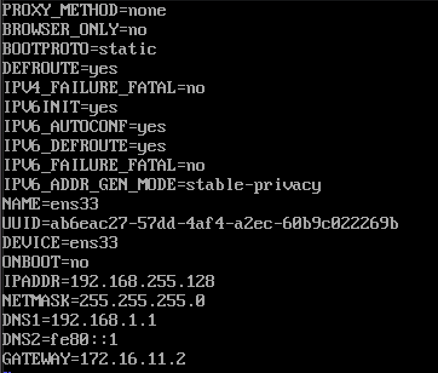

# 安装centOS遇到的坑和解决方法

## 安装VMware

> 大火都是软件工程的学生。。。

## 安装CentOS7

1. 下载CentOS Minimal
   > http://mirrors.aliyun.com/centos/7.8.2003/isos/x86_64/
2. 在VMware中安装centOS7
   > 这里选择的都是默认配置，20GB硬盘，1GB内存

## 配置CentOS7

### 配置网络

1. 虚拟机选择NAT模式
2. Mac终端获取vmnet8的gateway地址
   ```
   # cat /Library/Preferences/VMware\ Fusion/vmnet8/nat.conf
   ```
   获得内容如下
   ```
   # NAT gateway address
   ip = 172.16.11.2
   netmask = 255.255.255.0
   ```
3. 修改Centos7中ifcfg-xxx文件
   centOS中
   ```
   # cd /etc/sysconfig/network-scripts
   ```
   备份并ls获取文件，在我的MAC上获取的是ifcfg-ens33
   ```
   # cp ./ifcfg-ens33 ./ifcfg-ens33.back
   ```
   编辑此文件，增加或修改BOOTPROTO,IPADDR,NETMASK,DNS1,DNS2,GATEWAY,ONBOOT配置。其中IPADDR为需要设定的静态ip值；NETMASK为mac的NETMASK；DNS1,DNS2也是mac中的dns配置；GATEWAY就是第2步中找到的gateway addr下的ip值
   同时更改IPV6_PRIVACY=no, PREFIX=24
   

### 安装wget
```
# yum install wget
```

### 安装git
```
# yum install git
```

### 安装jdk
1. 安装jdk
   ```
   # yum search java|grep jdk
   ```
   搜索所有支持的jdk

   ```
   # yum install java-1.8.0-openjdk
   ```
   这里安装java 1.8 jdk

   默认安装位置/usr/lib/jvm
2. 验证安装
   ```
   java -version
   ```

### 安装mysql
1. 安装yum repo
   > 由于CentOS 的yum源中没有mysql，需要到mysql的官网下载yum repo配置文件。
   ```
   # wget https://dev.mysql.com/get/mysql57-community-release-el7-10.noarch.rpm
   ```
2. repo安装
   ```
   # rpm install mysql57-community-release-el7-10.noarch.rpm
   ```
3. 安装mysql的服务器
   ```
   # yum -y install mysql-community-server
   ```
4. 启动和停止mysql服务
   ```
   # systemctl start mysqld
   # systemctl stop mysqld
   ```
   ```
   # systemctl status mysqld
   ```
   查看mysql运行状况

### 配置mysql
1. 获取root密码
   ```
   # grep "password" /var/log/mysqld.log
   ```
   
2. mysql -u root -p 输入密码登陆
3. 更改密码
   ```
   mysql> ALTER USER 'root'@'localhost' IDENTIFIED BY 'new password';
   ```
4. 设置远程访问
   ```
   mysql> grant all privileges on *.* to 'root'@'192.168.0.1' identified by 'password' with grant option;
   mysql> flush privileges;
   ```
5. 更改mysql语言
   ```
   # vi /etc/my.ini
   ```
   增加四个语句
   

### 安装python3.7
1. 安装Python 3.7所需的依赖否则安装后没有pip3包
   ```
   # yum install zlib-devel bzip2-devel openssl-devel ncurses-devel sqlite-devel readline-devel tk-devel libffi-devel gcc make
   ```
2. 下载python
   ```
   # wget https://www.python.org/ftp/python/3.7.4/Python-3.7.4.tgz
   ```
3. 解压
   ```
   # tar -xvf Python-3.7.0.tgz
   ```
4. 配置编译
   ```
   # cd Python-3.7.0
   ```

   - 选其一：
      ```
      # ./configure --prefix=/usr/local/python3  //配置编译的的路径（这里--prefix是指定编译安装的文件夹）
      ```
      ```
      # ./configure --enable-optimizations  //执行该代码后，会编译安装到 /usr/local/bin/ 下，且不用添加软连接或环境变量
      ```
   ```
   # make && make install
   ```
   - 可选：
      ```
      # ln -s /usr/local/python3/bin/python3 /usr/bin/python3  //添加软连接
      ```
      ```
      # ln -s /usr/local/python3/bin/pip3 /usr/bin/pip3
      ```