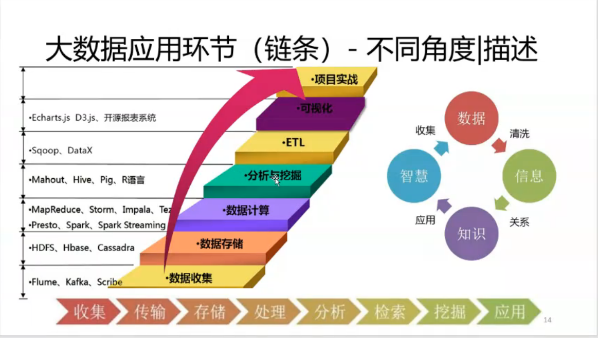
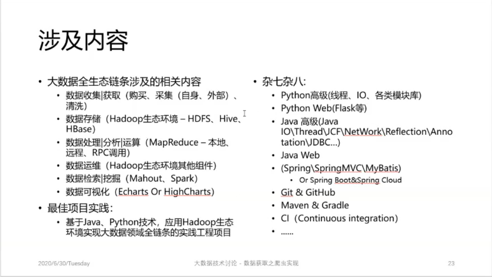
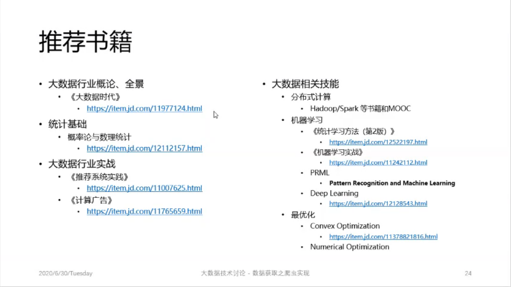

# Spider

## 获取数据 - 页面数据
来源
1. 直接下载使用，完成脱敏、省去预处理阶段
    
    政府机关、统计类网站

    NetFlix、Movielens、Kaggle、天池

2. 自身生成的数据
    
    业务数据：用户、商品、购买、收藏&关注、点赞&评分

    行为数据：浏览记录、搜索记录、停留信息 ~~（有效的，点进去就退出不算）~~

    - 埋点
    - 刘鹏 计算广告、项亮 推荐系统实战

3. 直接页面获取 - spider
    > baidu, google

4. 黑产

## 大数据本质
> IOE架构 \
> D3 -> 数据可视化 \
> 小木虫、网站 \
> [Aminer](https://www.aminer.cn/) 清华唐杰教授维护的项目 \
> [SemanticScholar](https://www.semanticscholar.org) \
> [Sci-Hub](http://www.sci-hub.ren/)
1. 4V + 1O
    - 典型特性：4V
      - Volume - 数据量大
      - Variety - 类型繁多
      - Value - 价值密度
      - Velocity - 速度快、时效高
    - 典型方式：1O
      - Online - 数据在线

2. 三维度
    - 数据来源
      - 交易数据 + 行为数据（日志数据）
    - 处理方式
      - 全量加工而非采样使用
    - 应用逻辑
      - 自动化应用而非简单洞察

3. 交易数据&行为数据
    1. 交易数据
        1. 定义
            - 业务流程中必须记录的数据
    2. 行为数据
        1. 定义

4. 处理问题的方式
    - 大规模计算不可避免

5. 三个层次
    - 顶层：意识
      - 数据优先经验、计算优先于人工
    - 中层：能力
      - 熟悉一项典型应用
      - 定义问题目标能力
    - 底层：技能
      - 分布式计算、编程语言、机器学习、最优化、博弈论

6. 相关技能

7. 推荐书籍

## 爬虫实现